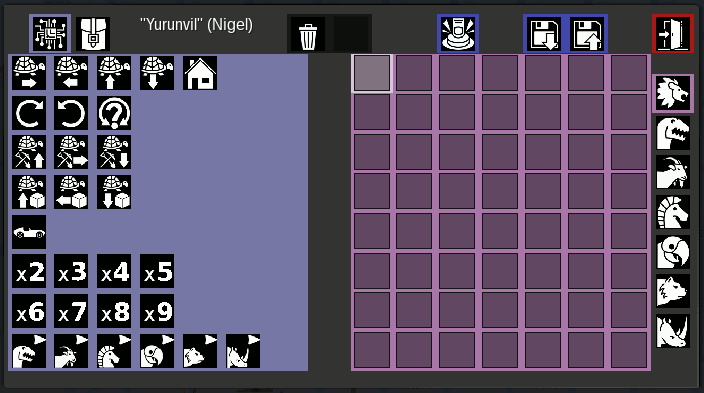
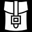
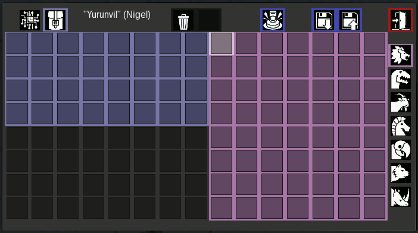
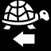
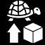
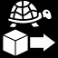
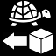
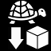

# vbots2

Мод визуального программирования роботов для [Luanti](https://www.luanti.org/) (ранее Minetest).

**Требуется Luanti 5.14.0+.** Протестировано на 5.14.0.

Vbots — это одно-блочные роботы-«черепашки», программируемые полностью визуально — не требуется ввод текста.

## Что Нового в vbots2

vbots2 добавляет **условную логику** и улучшения на базе оригинального [visual-bots от Nigel Garnett](https://content.luanti.org/packages/Nigel/vbots/):

- Условные команды:    — проверка блоков впереди, содержимого сундуков
- Сравнение значений:     — сравнение переменных/чисел
- Переменные A–D и  — ячейки памяти через таблички (авто-создание если нет), подсчёт предметов
- Команда  — остановка в главной программе, возврат из подпрограммы
- Сундуки — build передаёт один предмет **вперёд** в сундук (фильтр по типу предмета); пустые сундуки забираются как блок
- Магнит — авто-подбор выпавших предметов в радиусе 1 блока; излишки исчезают
- Земля = проросшая земля — `dirt` и `dirt_with_grass` считаются одним блоком в условиях
- Редактируемое имя бота, исправление вылета (formspec больше не крашит при движении), выпадение предметов при удалении

---

## Основы

- **Ударьте** неактивного бота **пустой рукой** чтобы запустить программу (или нажмите иконку запуска в меню).
- **Ударьте** работающего бота **пустой рукой** чтобы остановить.
- **ПКМ** (двойной тап на Android) чтобы открыть меню.
- **Сломайте бота** ударив чем угодно кроме пустой руки. Предметы из инвентаря выпадут на землю.

### Крафт

| | | |
|---|---|---|
| Железо | Железо | Железо |
| Железо | Редстоун | Железо |
| Железо | Железо | Железо |

→ **1 Вбот (неактивный)**

---

## Главное Меню



Иконки **команды**  и **инвентарь**  переключают между двумя панелями.

**Панель команд** (слева, показана выше) содержит все доступные команды. Нажмите на команду чтобы добавить её в текущую подпрограмму (красная область справа).

**Панель инвентаря** показывает инвентарь бота (сверху) и инвентарь игрока (снизу). Используйте эту панель чтобы дать боту стройматериалы или забрать собранные предметы.



### Управление

| Иконка | Действие |
|--------|---------|
|  **Корзина** | Удаляет последнюю инструкцию на текущей странице подпрограммы |
|  **Пуск** | Запускает программу (то же, что удар пустой рукой) |
|  **Сохранить** | Сохраняет текущую программу и подпрограммы под именем бота |
|  **Загрузить** | Открывает меню загрузки для выбора, переименования или удаления сохранённых программ |
|  **Удалить Всех** | 1-е нажатие: остановить всех. 2-е (в теч. 2с): уничтожить всех ботов |
|  **Сброс** | Очищает все программы (главную и подпрограммы), но сохраняет инвентарь |
|  **Выход** | Закрывает меню |

### Подпрограммы

Красная панель справа имеет **7 страниц**:

| Иконка | Страница |
|--------|----------|
|  | **Главная** программа — выполнение начинается отсюда |
|  | Подпрограмма 1 |
|  | Подпрограмма 2 |
|  | Подпрограмма 3 |
|  | Подпрограмма 4 |
|  | Подпрограмма 5 |
|  | Подпрограмма 6 |

Вызов подпрограмм — через иконки функций внизу панели команд.

---

## Команды

### Движение

| Иконка | Команда | Описание |
|--------|---------|----------|
|  | Вперёд | Один шаг вперёд |
|  | Назад | Один шаг назад |
|  | Вверх | Один шаг вверх |
|  | Вниз | Один шаг вниз |
|  | Домой | Телепорт к месту создания |
|  | К игроку | Телепорт к игроку |
|  | К позиции | Телепорт к координатам (ищет свободное место рядом) |

> **Расположение в меню:**  END находится в том же ряду, что и  (справа от К позиции) на панели команд.

Движение невозможно, если целевая позиция не пуста. **Гравитация отключена:** бот остаётся на месте, даже если под ним воздух — может парить в пустоте.

### Повороты

| Иконка | Команда | Описание |
|--------|---------|----------|
|  | По часовой | Поворот на 90° вправо |
|  | Против часовой | Поворот на 90° влево |
|  | Случайно | Поворот в случайную сторону |

### Копание и Строительство

| Иконка | Команда | Описание |
|--------|---------|----------|
|  | Копать вперёд | Копает блок впереди и заходит в него |
|  | Копать вверх | Копает блок сверху и поднимается |
|  | Копать вниз | Копает блок снизу и опускается |
|  | Строить вверх | Ставит блок над позицией впереди |
|  | Строить вперёд | Ставит блок впереди (или в сундук впереди) |
|  | Строить назад | Ставит блок позади (или в сундук позади) |
|  | Строить вниз | Ставит блок под позицией впереди |

**Строительство:**
- Команды строительства **НЕ тратят блоки** из инвентаря бота (творческий режим — блоки создаются из воздуха)
- Если цель — **воздух** → ставит выбранный тип блока
- Если цель — **сундук/контейнер** (нода с `container` группой) → передаёт первый предмет из инвентаря (или совпадающий, если фильтр в следующем слоте)
- Если инвентарь пуст → ничего не происходит

**Копание и Подбор:**
- Собранные предметы попадают в инвентарь бота
- **Магнит:** бот автоматически подбирает выпавшие предметы в радиусе 1 блока каждый тик
- Если инвентарь полон — излишки **исчезают** (не падают на землю во избежание циклов подбора)
- **Сундуки:** пустой → забирается как блок; не пустой → забираются предметы (опциональный фильтр в следующем слоте)

### Условия

| Иконка | Команда | Описание |
|--------|---------|----------|
|  | **Впереди этот блок?** | Выполнить след. команду **только если** блок впереди совпадает |
|  | **Впереди НЕ этот блок?** | Выполнить след. команду **только если** блок впереди НЕ совпадает |
|  | **Есть в сундуке?** | Выполнить след. команду **только если** в сундуке впереди есть предмет |
|  | **Значение > Значение?** | Выполнить след. если первое больше второго |
|  | **Значение < Значение?** | Выполнить след. если первое меньше второго |
|  | **Значение >= Значение?** | Выполнить след. если первое больше или равно |
|  | **Значение <= Значение?** | Выполнить след. если первое меньше или равно |

**Как работают условия:**

Условие использует 3 слота в программе:

```
[ =? ] [ блок ] [ команда ] [ дальше... ]
  (1)     (2)      (3)          (4)
```

1. **Слот 1** — команда условия ( или )
2. **Слот 2** — **блок для проверки** (положите сюда любой предмет-блок, например `Камень`, `Земля`)
3. **Слот 3** — **команда, которая выполнится, если условие истинно**
4. **Слот 4+** — выполняется всегда

Если слот 2 пуст — проверяется **воздух** (впереди ничего нет).

**Особенность:** `земля` и `проросшая земля` (и их `mcl_core:` варианты) считаются одним блоком.

**Сравнение значений** использует 3 слота, левый операнд — **активная переменная**:

```
[ >? ] [ arg ] [ true-cmd ] [ дальше... ]
```

- **Левый операнд** — **активная переменная** (выбирается – перед сравнением)
- **Слот arg** — правый операнд: число (–), переменная (A–D), или блок (= 1). Пусто = 0.
- **Слот true-cmd** — выполняется если сравнение истинно
- Если ложно — true-cmd пропускается, дальше выполняется

    
→ Если var_a > 2: вперёд, затем вправо. Иначе: только вправо.

### Переменные и Подсчёт

| Иконка | Команда | Описание |
|--------|---------|----------|
|  | **Var A** | Выбрать переменную A активной |
|  | **Var B** | Выбрать переменную B активной |
|  | **Var C** | Выбрать переменную C активной |
|  | **Var D** | Выбрать переменную D активной |
|  | **Чтение таблички** | Прочитать число с таблички впереди в указанную переменную (создаст если нет) |
|  | **Запись на табличку** | Записать указанную переменную на табличку (создаст если нет) |
|  | **Подсчёт** | Посчитать предметы в инвентаре, сохранить в активную переменную |

**Переменные как множители:** поставьте переменную после команды чтобы повторить её N раз:

 
→ Если var_a = 5, движется вперёд 5 раз.

**Загрузка переменных:**
- **Таблички:**   → читает число с таблички впереди в var_b
- **Подсчёт:** `[A]` `[count]` \+ [Камень] → считает весь камень в инвентаре, сохраняет в var_a
- **Запись:**   → записывает var_c на табличку впереди

### Управление Программой

| Иконка | Команда | Описание |
|--------|---------|----------|
|  | **F1** | Вызов подпрограммы 1 |
|  | **F2** | Вызов подпрограммы 2 |
|  | **F3** | Вызов подпрограммы 3 |
|  | **F4** | Вызов подпрограммы 4 |
|  | **F5** | Вызов подпрограммы 5 |
|  | **F6** | Вызов подпрограммы 6 |
|  | **Конец** | Остановка (в главной) или возврат (из подпрограммы) |
|  | **Скорость** | Установить частоту шагов (использовать с числом или переменной) |

**Скорость:** используйте  с числом (–) или переменной чтобы задать частоту шагов бота. Без множителя — сброс до нормальной (1 шаг/тик).

### Множители (Числа)

|  |  |  |  |  |  |  |
|----------------------------------------|------|------|------|------|------|------|

Поставьте число **после** команды чтобы повторить её (N−1) дополнительных раз. Работает со всеми командами.  задаёт множитель частоты шагов.

### Бой

| Иконка | Команда | Описание |
|--------|---------|----------|
|  | **Лазер** | Выстрел по ближайшему hostile (10 блоков, конус 90°, урон=10, 4с перезарядка с искрами). 2 выстрела на зомби. |
|  | **Бросок** | Снежок в ближайшего hostile (30 блоков, конус 90°, урон=40, 6с перезарядка, скорость ~6.7). 1 выстрел на зомби. |
|  | **Враг?** | Пропустить следующую команду если hostile в радиусе 5 блоков |
|  | **Ранен?** | Пропустить следующую команду если бот атакован за последние 3 секунды |
|  | **Поворот→** | Повернуться в сторону атакующего (последние 3с). Искры если атак не было. |
|  | **P2P Вкл** | Режим «игрок против игрока»: любой чужой игрок считается враждебным. Активная кнопка подсвечена на панели. |
|  | **P2P Выкл** | По умолчанию: стрелять только по мобам, игроков не трогать. |

**Лазер и Бросок** стреляют только в конусе 90° по направлению взгляда бота. Оба целятся в центр цели (y+1) и проверяют прямую видимость (игнорируя флору, траву, растения, цветы, факелы, листву).
**Бросок** создаёт снаряд (`vbots2:projectile_snowball`) с текстурой снежка, прямым полётом (без гравитации), скоростью ~6.7 блоков/с (~3с на 20 блоков), радиусом попадания 1.5 блока и таймаутом 5с.
**[Ранен?]** и **[Поворот→]** отслеживают урон через боевую сущность бота (`vbots2:bot_body`) — работают с любыми атаками мобов.
Бот использует `is_hostile_entity()`: проверяет `type=="monster"`, `hostile`, `_is_hostile`, `_attack`, `passive==false` на runtime сущности + fallback на registered definition.
`is_valid_target()` исключает выпавшие предметы, vbots2:*, mcl_burning:*, mcl_wieldview:* и любого игрока.
В режиме **P2P Вкл** любой чужой игрок становится целью для Лазера, Броска, Враг?, Поворот→ и тарана — владелец бота всегда исключён.
Боевая сущность (`vbots2:bot_body`): type=animal, HP=20, невидима (`visual_size={0,0,0}`), имеет флаги `hostile=true` и `_attack=1` — мобы атакуют её естественно. Мобам с таблицей `specific_attack` добавляется `"vbots2:bot_body"` безусловно при загрузке мода (задержка 1с).
HP зомби = 20.

---

## Новое Поведение

vbots2 вводит несколько изменений в поведении:

- **Творческий режим стройки** — команды строительства не тратят блоки из инвентаря бота. Блоки создаются из воздуха, поэтому не нужно снабжать бота материалами.
- **Отсутствие гравитации** — бот больше не падает, если под ним воздух. Может парить в пустоте, позволяя строить на высоте и под потолком.
- **Телепортация** — ,  и  мгновенно телепортируют вместо поиска пути. Бот исчезает и появляется в цели.
- **Движение вверх** —  позволяет боту сделать шаг вверх, дополняя существующую команду движения вниз.
- **Режим P2P** —  заставляет бота считать любого чужого игрока враждебной целью (Лазер, Бросок, Враг?, Поворот→ и таран).  возвращает бой только с мобами. Активная кнопка режима подсвечена на панели.

---

## Примеры

### Пример 1: Прогулка с Разворотом


4 шага вперёд, разворот на 180°, 4 шага обратно к старту, разворот в исходное направление.

### Пример 2: Использование Подпрограммы

В подпрограмме 1 ():


В главной ():


Вызов подпрограммы дважды.

### Пример 3: Условное Копание

Проверка: если впереди НЕ земля — копать, иначе просто идти вперёд:


\+ [Предмет Земля]


> Поместите блок **Земли** (из своего инвентаря) в слот после .  
> Если впереди НЕ земля (и не проросшая земля) → копает и движется вперёд.  
> Если земля → пропускает копание, просто идёт вперёд.

### Пример 4: Копать Пока Не Камень

Копать вперёд в цикле, но остановиться когда впереди камень:


\+ [Предмет Камень]


> Поместите блок **Камня** в слот-аргумент после . В зацикленной программе бот:
> - Если впереди камень → попадает на END и останавливается навсегда
> - Если впереди НЕ камень → **пропускает** END, копает, движется вперёд и домой (цикл продолжается)

### Пример 5: Найти Блок, Копать

 \+ [Камень]  
→ Если впереди камень: копать и двигаться вперёд. Иначе: только вперёд.

### Пример 6: Взять из Сундука

 \+ [Камень]  
→ Если в сундуке впереди есть камень: взять один (бот остаётся на месте — сундук блокирует движение). Иначе: двинуться вперёд.

### Пример 7: Подсчёт и Сравнение

  \+ [Камень]
  

→ Посчитать камни в инвентаре → var_a. Если var_a > 3: остановка. Иначе: шаг вперёд.

### Пример 8: Чтение Таблички, Умножение

 
 
→ Прочитать число с таблички впереди в var_b. Двинуться вперёд var_b раз.

### Пример 9: Выгрузка в Сундук


→ Если **впереди** сундук: передаёт первый предмет из инвентаря.  
→  \+ [Камень]: передаёт один камень в сундук.  
→ Если сундука нет: ставит блок впереди.

---

## На Основе

Данный мод создан на основе **[visual-bots](https://content.luanti.org/packages/Nigel/vbots/)** (© 2019 Nigel Garnett).  
Расширен условными командами, взаимодействием с сундуками, переменными и различными исправлениями.
